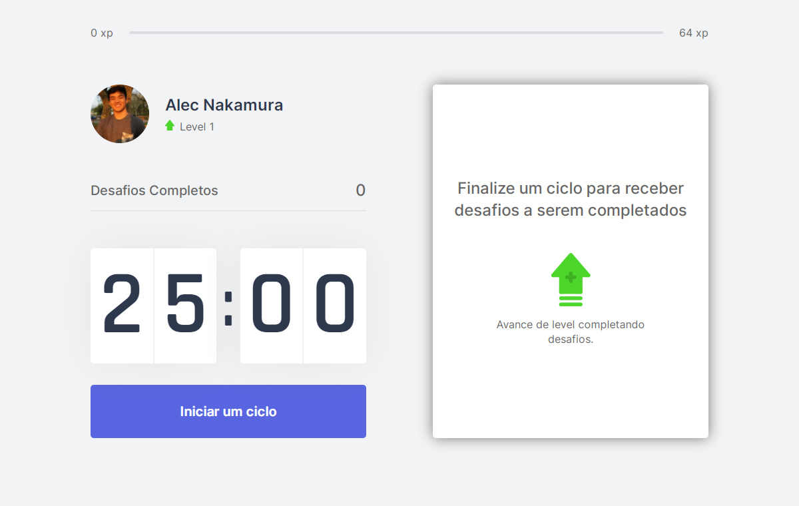
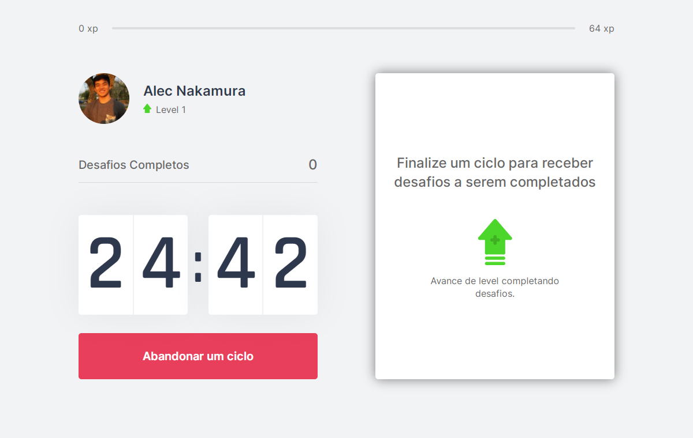
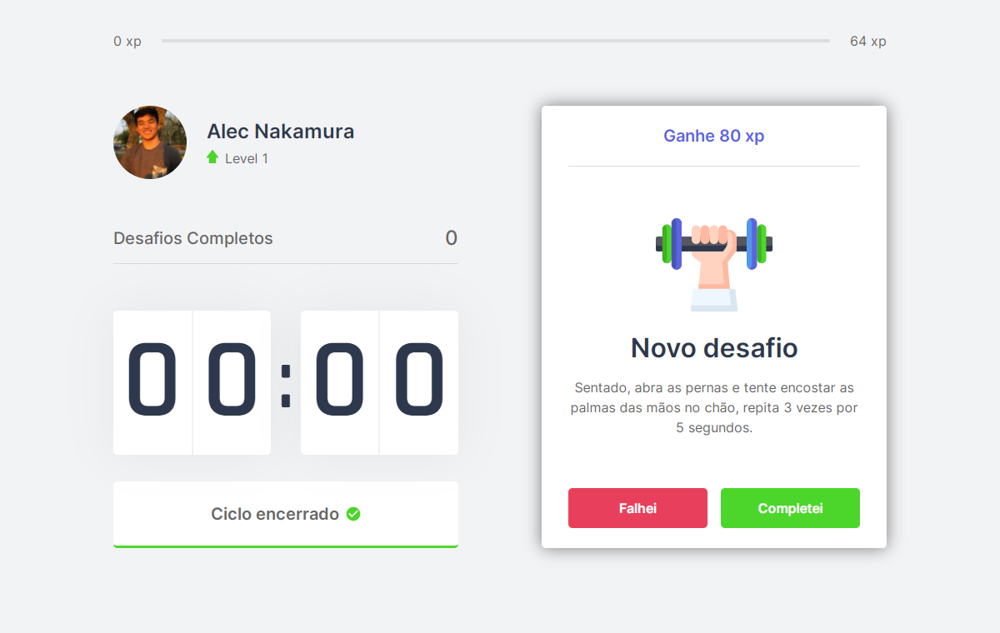
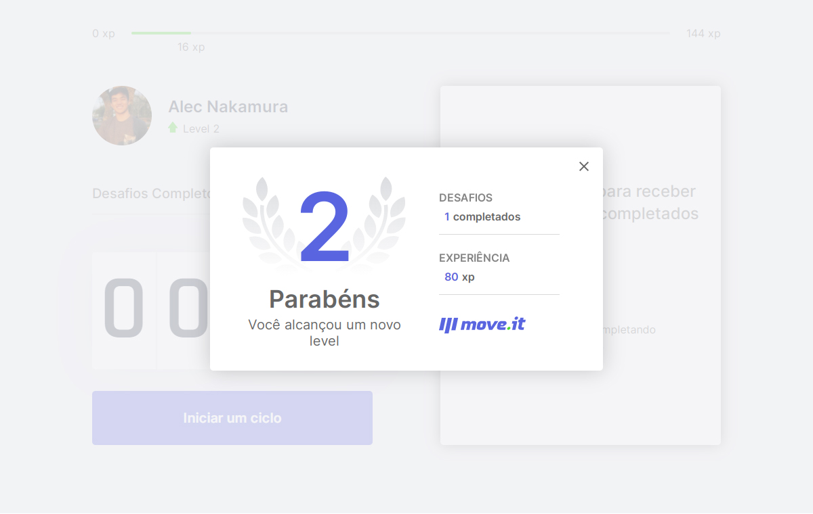
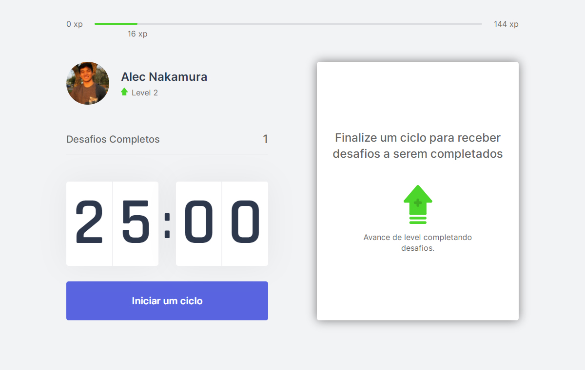

  

  <a href="#newspaper-sobre">Sobre</a> •
  <a href="#framed_picture-telas">Telas</a> •
  <a href="#computer-tecnologias">Tecnologias</a> •

# :newspaper: Sobre 

O Move.it é um App que implementa a [Técnica Pomodoro](https://www.estudaqui.com/blog/organizacao-de-estudos/tecnica-pomodoro-estudar/), porém na forma de um mini game. Cada vez que o usuário completa um desafio, 
exercícios físicos de curta duração, ele ganha xp para poder avançar para o próximo nível.

 

# :framed_picture: Telas

  

     &nbsp
     &nbsp
     &nbsp
  

  

     &nbsp
     &nbsp
     &nbsp
  

 
 

# :computer: Tecnologias

As seguintes ferramentas foram usadas na construção do projeto:

  - [React](https://reactjs.org/)
  - [Next.js](https://nextjs.org)
  - [Node.js](https://nodejs.org/en/)
  - [Typescript](https://www.typescriptlang.org/)
  - [VS Code](https://code.visualstudio.com/)

 
